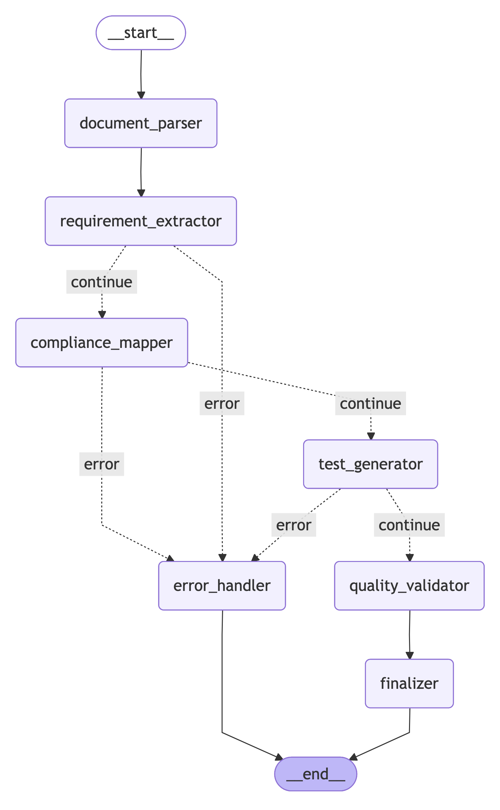

# Healthcare Test Case Generation System

An AI-powered system that automatically converts healthcare software requirements into compliant, traceable test cases using LangGraph and Google Gemini models.

## Features

- **AI-Powered Requirement Extraction**: Uses Google Gemini to understand healthcare domain requirements
- **Compliance Mapping**: Automatically maps requirements to healthcare standards (FDA, HIPAA, IEC 62304, ISO 27001, GDPR)
- **Comprehensive Test Generation**: Creates positive, negative, boundary, and security test cases
- **Quality Validation**: Assesses completeness, accuracy, and traceability of generated test cases
- **Session Memory**: Maintains context across multi-step conversations
- **LangGraph Workflow**: Multi-step AI agent with conditional routing and error handling
- **Healthcare Domain Knowledge**: Specialized for medical devices, EHR, clinical decision support, and more

## Architecture

```
src/testcaseaiagent/
├── core/                    # Configuration and settings
│   ├── __init__.py
│   └── config.py
├── models/                  # Data models and schemas
│   ├── __init__.py
│   └── base.py
├── services/               # Business logic services
│   ├── __init__.py
│   ├── document_parser.py
│   ├── requirement_extractor.py
│   ├── compliance_mapper.py
│   ├── test_generator.py
│   ├── quality_validator.py
│   └── session_memory.py
├── workflows/              # LangGraph workflow orchestration
│   ├── __init__.py
│   └── main_workflow.py
├── utils/                  # Utility functions
│   └── __init__.py
├── __init__.py
└── main.py                 # Main entry point
```

## Quick Start

### Option 1: Docker

```bash
# Clone the repository
git clone https://github.com/bharath03-a/TestCaseAI.git
cd TestCaseAIAgent

# Build Docker image
docker build -t testcase-ai-agent .

# Run with environment variables
docker run -e GOOGLE_API_KEY="your_api_key" -v $(pwd)/data:/app/data testcase-ai-agent
```

### Option 2: Local Installation

```bash
# Clone the repository
git clone https://github.com/bharath03-a/TestCaseAI.git
cd TestCaseAIAgent

# Install dependencies
pip install -e .
```

### Configuration

Set your API keys:

```bash
export GOOGLE_API_KEY="your_gemini_api_key_here"
export TAVILY_API_KEY="your_tavily_api_key_here"
```

### Run the System

```bash
# Using the run script (recommended)
python run.py

# Or directly
python examples/basic_usage.py
```

## Example Output

```
Healthcare Test Case Generation System
==================================================
API keys configured
Starting system...
Processing Results:
Success: True
Session ID: c86c3d73-11e1-4366-9036-445d8ee3a49d
Requirements Count: 10
Test Cases Count: 34
Quality Score: 1.0
```

## Configuration

The system uses environment variables for configuration. See `env_template.txt` for all available options.

### Key Settings

- `GOOGLE_API_KEY`: Required - Your Google Gemini API key
- `TAVILY_API_KEY`: Optional - For enhanced search capabilities
- `GEMINI_MODEL`: Default - `gemini-2.5-pro`
- `GEMINI_TEMPERATURE`: Default - `0.3`
- `MIN_COMPLETENESS_SCORE`: Default - `0.8`

## Healthcare Compliance Standards

The system supports mapping to these healthcare standards:

- **FDA**: Food and Drug Administration regulations
- **HIPAA**: Health Insurance Portability and Accountability Act
- **IEC 62304**: Medical device software lifecycle processes
- **ISO 27001**: Information security management
- **ISO 13485**: Medical devices quality management
- **ISO 9001**: Quality management systems
- **GDPR**: General Data Protection Regulation

## Generated Test Cases

The system generates comprehensive test cases including:

- **Positive Test Cases**: Verify normal operation
- **Negative Test Cases**: Handle invalid inputs gracefully
- **Boundary Test Cases**: Test edge conditions and limits
- **Security Test Cases**: Validate security controls

## Workflow Process

The system uses a multi-step LangGraph workflow with conditional routing and error handling. The diagram below shows the actual workflow structure:



*Workflow diagram generated using LangGraph's built-in visualization capabilities*

### Workflow Steps:

1. **Document Parsing**: Extract text from various document formats
2. **Requirement Extraction**: Use AI to identify and structure requirements
3. **Compliance Mapping**: Map requirements to relevant standards
4. **Test Generation**: Create comprehensive test cases
5. **Quality Validation**: Assess generated content quality
6. **Finalization**: Generate reports and store results

## Docker

The application can be run using Docker for easy deployment:

```bash
# Build the image
docker build -t testcase-ai-agent .

# Run with environment variables
docker run -e GOOGLE_API_KEY="your_key" testcase-ai-agent

# Run with volume for data persistence
docker run -e GOOGLE_API_KEY="your_key" -v $(pwd)/data:/app/data testcase-ai-agent
```

## Development

### Project Structure

- **`src/`**: Main source code organized in modules
- **`docs/`**: Documentation
- **`examples/`**: Usage examples
- **`Dockerfile`**: Docker container configuration

### Adding New Features

1. Create new service in `src/testcaseaiagent/services/`
2. Add workflow node in `src/testcaseaiagent/workflows/main_workflow.py`
3. Update models in `src/testcaseaiagent/models/` if needed
4. Add configuration options in `src/testcaseaiagent/core/config.py`

## Usage

```python
from src.testcaseaiagent.workflows import HealthcareTestCaseGenerator
from src.testcaseaiagent.models import ComplianceStandard

# Initialize the generator
generator = HealthcareTestCaseGenerator()

# Process documents
documents = [
    {
        "filename": "requirements.pdf",
        "content": "The system shall provide secure patient data management..."
    }
]

result = generator.process_documents(
    documents=documents,
    compliance_standards=[
        ComplianceStandard.FDA,
        ComplianceStandard.HIPAA,
        ComplianceStandard.IEC_62304
    ]
)

print(f"Generated {len(result['test_cases'])} test cases")
```

## Troubleshooting

### Common Issues

1. **API Key Errors**: Ensure `GOOGLE_API_KEY` is set and valid
2. **Import Errors**: Run `pip install -e .` to install the package
3. **Memory Issues**: The system uses session memory - check disk space
4. **Rate Limits**: Adjust `MAX_REQUESTS_PER_MINUTE` in configuration

### Debug Mode

Set `LOG_LEVEL=DEBUG` for detailed logging:

```bash
export LOG_LEVEL=DEBUG
python run.py
```

## Performance

- **Processing Speed**: ~1-2 seconds per document
- **Memory Usage**: ~100MB base + 50MB per session
- **Concurrent Sessions**: Up to 10 (configurable)
- **Session Timeout**: 60 minutes (configurable)

## Contributing

1. Fork the repository
2. Create a feature branch
3. Make your changes
4. Add tests
5. Submit a pull request

## License

This project is licensed under the MIT License - see the LICENSE file for details.

## Support

For support and questions:

- Create an issue in the repository
- Check the documentation in the `docs/` folder
- Review the examples in the `examples/` folder

---

**Built for the healthcare industry using LangGraph and Google Gemini**
